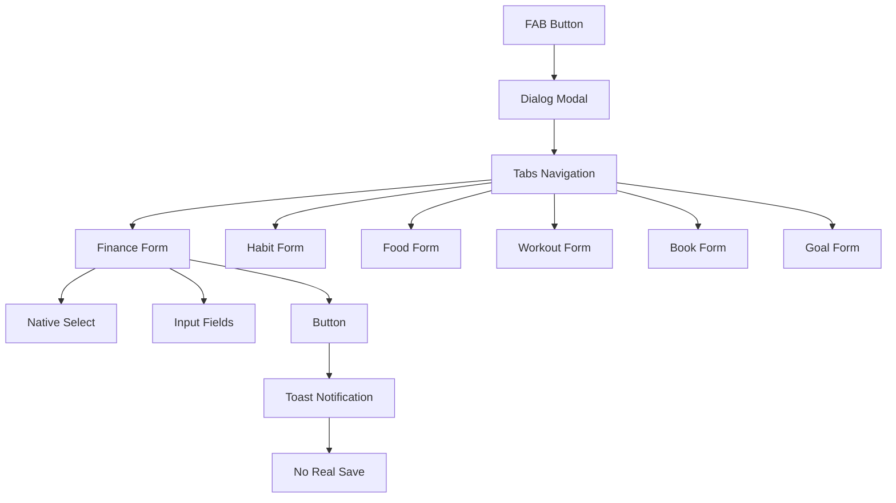
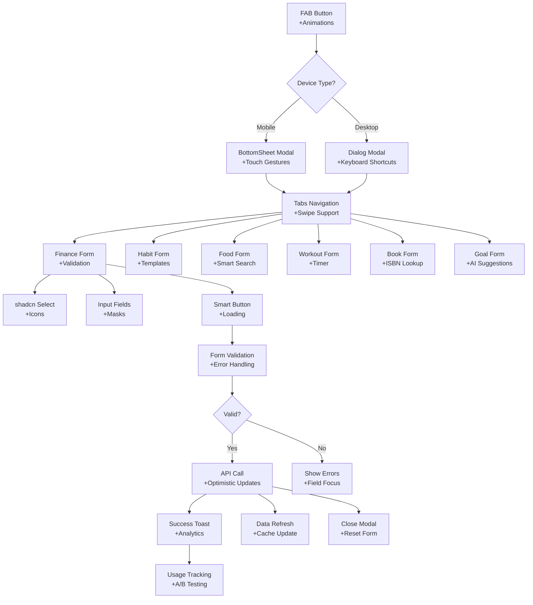

# 📱 **QuickAdd Архитектура: Before vs After**

## **🔄 Текущая Архитектура**



## **🚀 Улучшенная Архитектура**



## **🧩 Ключевые Компоненты Улучшений**

### **1. Адаптивная Модальность**
```typescript
// Умное определение типа модального окна
const ModalComponent = isMobile ? BottomSheet : Dialog;
```

### **2. Умная Валидация**
```typescript
// Прогрессивная валидация с обратной связью
const validationSchema = {
  finance: {
    amount: (value) => value > 0 || "Сумма должна быть положительной",
    description: (value) => value.length > 0 || "Описание обязательно"
  }
};
```

### **3. Быстрые Действия**
```typescript
// Шаблоны для частых действий
const quickActions = [
  {
    id: 'coffee',
    icon: '☕',
    label: 'Кофе',
    preset: { amount: 150, category: 'cafe', description: 'Кофе' }
  }
];
```

### **4. Контекстное Поведение**
```typescript
// Адаптация под время суток и контекст
const contextualDefaults = {
  morning: { food: 'Завтрак', habit: 'Утренние процедуры' },
  evening: { food: 'Ужин', habit: 'Подготовка ко сну' }
};
```

## **🔄 Data Flow Улучшения**

### **Before: Поверхностный Flow**
```
User Input → Toast → Nothing
```

### **After: Полноценный Flow**
```
User Input → Validation → API Call → Optimistic Update → Analytics → Success Feedback
```

### **Error Handling Flow**
```
Validation Error → Field Highlight → Error Message → Auto-focus → Retry
```

## **📊 UX Metrics Tracking**

### **Ключевые Метрики**
- **Completion Rate**: Доля завершенных добавлений
- **Time to Complete**: Среднее время добавления записи
- **Error Rate**: Процент форм с ошибками валидации
- **Template Usage**: Популярность быстрых шаблонов
- **Device Distribution**: Мобильный vs десктоп usage

### **A/B Testing Framework**
```typescript
// Возможность тестирования разных UX подходов
const abTests = {
  fabStyle: ['static', 'morphing', 'mini-menu'],
  validationStyle: ['inline', 'summary', 'progressive'],
  templatePosition: ['top', 'bottom', 'contextual']
};
```

## **🎯 Миграционный План**

### **Phase 1: Foundation** (1-2 дня)
- ✅ Замена select на shadcn компоненты
- ✅ Добавление базовой валидации
- ✅ Мобильная адаптация с BottomSheet

### **Phase 2: Enhancement** (2-3 дня)
- ✅ Быстрые шаблоны для популярных действий
- ✅ Улучшенные анимации FAB
- ✅ Smart defaults и автозаполнение

### **Phase 3: Intelligence** (3-5 дней)
- ✅ AI-powered предложения
- ✅ Контекстные подсказки
- ✅ Продвинутая аналитика

### **Phase 4: Optimization** (1-2 дня)
- ✅ Performance оптимизация
- ✅ Accessibility улучшения
- ✅ Cross-platform тестирование

---

## **💡 Ключевые Принципы Дизайна**

### **1. Progressive Enhancement**
- Базовая функциональность работает всегда
- Продвинутые функции добавляются постепенно
- Graceful degradation для старых устройств

### **2. Context Awareness**
- Адаптация под время суток
- Учет геолокации и привычек пользователя
- Предложения на основе истории использования

### **3. Touch-First Design**
- 44px минимум для touch targets
- Swipe gestures для навигации
- Haptic feedback на поддерживаемых устройствах

### **4. Zero-Friction UX**
- Минимум обязательных полей
- Smart defaults и автозаполнение
- Быстрые действия для повторяющихся задач