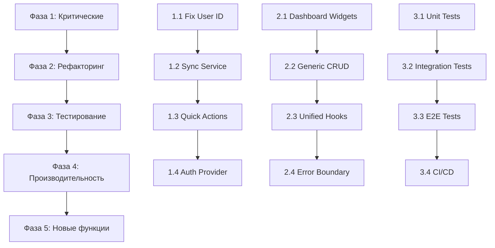

# LifeOS — Анализ готовности и план развития

**Дата анализа:** 2026-03-16  
**Версия:** 0.1.0

---

## 📊 Резюме готовности

| Аспект | Статус | Комментарий |
|--------|--------|-------------|
| **Архитектура** | ✅ Готова | Next.js 16, React 19, TypeScript, Tailwind CSS 4 |
| **База данных** | ✅ Готова | 50+ таблиц в Dexie.js schema |
| **UI Компоненты** | ✅ Готова | shadcn/ui, PWA, адаптивная верстка |
| **Модули (8 шт)** | ✅ Готова | Finance, Nutrition, Workouts, Habits, Goals, Health, Mind, Beauty |
| **Доп. модули** | ✅ Готова | Automations, Sharing, Widgets |
| **Аутентификация** | ⚠️ Частично | Есть local mode, но есть hardcoded user_id |
| **Синхронизация** | ⚠️ Частично | Сервис есть, но не работает с реальным user |
| **Тесты** | ❌ Отсутствуют | Только конфиг vitest |
| **CI/CD** | ❌ Отсутствует | Нет GitHub Actions |

---

## 🔴 Критические проблемы

### 1. Hardcoded User ID

**Проблема:** В проекте используются захардкоженные значения `user_id`:

| Файл | Строки | Значение |
|------|--------|----------|
| [`use-habits.ts:100`](src/modules/habits/hooks/use-habits.ts) | 100 | `'current-user'` |
| [`use-user-id.ts:15`](src/shared/hooks/use-user-id.ts) | 15 | `'supabase-user'` |
| [`sync-service.ts:367`](src/core/sync/sync-service.ts) | 367 | `'demo-user'` |

**Влияние:** Все данные сохраняются под одним ID, данные разных пользователей будут смешиваться.

**Решение:** Реализовать полноценный AuthContext.

---

### 2. Синхронизация не работает

**Проблема:** SyncService использует `getCurrentUserId()` который возвращает захардкоженное значение.

```typescript
// sync-service.ts:364-368
private async getCurrentUserId(): Promise<string | null> {
  return 'demo-user'; // ❌ Хардкод
}
```

**Решение:** Интегрировать с Supabase Auth, использовать реальный user.id.

---

### 3. Quick Actions не функциональны

**Проблема:** В dashboard кнопки быстрых действий не имеют обработчиков:

```typescript
// page.tsx:302-317
<button className="flex items-center justify-between ...">
  <span>Добавить транзакцию</span>
  {/* ❌ Нет onClick */}
</button>
```

---

## 🟡 Средние проблемы

### 4. Dashboard слишком большой

**Проблема:** [`page.tsx`](src/app/page.tsx) — 356 строк со всей логикой виджетов.

**Рекомендация:** Извлечь в отдельные компоненты:
- `BalanceWidget.tsx`
- `HabitsWidget.tsx`
- `WorkoutsWidget.tsx`
- `QuickActions.tsx`

---

### 5. Дублирование кода в модулях

Каждый модуль содержит похожие сервисы:
- `AccountService`, `TransactionService`, `CategoryService` (finance)
- `HabitService`, `HabitLogService` (habits)
- и т.д.

**Рекомендация:** Создать Generic CRUD Base Service.

---

### 6. Нет тестов

**Проблема:** Vitest настроен, но практически нет тестов (только [`utils.test.ts`](src/lib/utils.test.ts)).

---

## 🟢 Что работает хорошо

1. **Архитектура** — чёткое разделение на core/modules/ui
2. **База данных** — полная схема с индексами
3. **UI/UX** — PWA, dark theme, responsive
4. **Аналитика** — Recharts графики на dashboard
5. **Локальный режим** — работает без интернета

---

## 📈 Метрики проекта

| Метрика | Значение |
|---------|----------|
| Страниц | 19 |
| Таблиц БД | 50+ |
| UI компонентов | 30+ |
| Строк кода | ~19,000 |
| Модулей | 11 |

---

## 🎯 План развития

### Фаза 1: Критические исправления (1-2 недели)

| # | Задача | Файлы |
|---|--------|-------|
| 1.1 | Исправить hardcoded user_id | [`use-user-id.ts`](src/shared/hooks/use-user-id.ts), [`use-habits.ts:100`](src/modules/habits/hooks/use-habits.ts) |
| 1.2 | Интегрировать SyncService с Supabase Auth | [`sync-service.ts`](src/core/sync/sync-service.ts) |
| 1.3 | Добавить onClick обработчики для Quick Actions | [`page.tsx`](src/app/page.tsx) |
| 1.4 | Создать AuthProvider | [`auth-context.tsx`](src/core/auth/auth-context.tsx) (новый) |

---

### Фаза 2: Рефакторинг (2-3 недели)

| # | Задача | Описание |
|---|--------|----------|
| 2.1 | Извлечь виджеты dashboard | Создать папку `src/features/dashboard/components/` |
| 2.2 | Создать Generic CRUD Service | [`base-crud.ts`](src/core/crud/base-crud.ts) |
| 2.3 | Унифицировать хуки модулей | Создать `useGenericCrud<T>()` |
| 2.4 | Добавить Error Boundary | [`error-boundary.tsx`](src/components/ui/error-boundary.tsx) (новый) |

---

### Фаза 3: Тестирование (2-3 недели)

| # | Задача | Описание |
|---|--------|----------|
| 3.1 | Unit тесты для core сервисов | database, auth, sync |
| 3.2 | Интеграционные тесты для модулей | finance, habits |
| 3.3 | E2E тесты (Playwright) | Dashboard, CRUD операции |
| 3.4 | Настроить CI/CD | GitHub Actions (lint, test, build) |

---

### Фаза 4: Производительность (1-2 недели)

| # | Задача | Описание |
|---|--------|----------|
| 4.1 | Анализ bundle size | Проверить с next/dynamic |
| 4.2 | Lazy loading для графиков | Recharts |
| 4.3 | React Query оптимизация | Персистентное кэширование |
| 4.4 | Lighthouse аудит | Добиться 90+ |

---

### Фаза 5: Новые функции (по желанию)

| # | Задача | Описание |
|---|--------|----------|
| 5.1 | Экспорт/импорт данных | JSON, CSV |
| 5.2 | Шаблоны данных | Seed data для новых пользователей |
| 5.3 | Темы оформления | Больше цветовых схем |
| 5.4 | Мобильное приложение | React Native / Expo |

---

## 🔄 Диаграмма зависимостей задач



---

## 📝 Рекомендуемые действия

### Сначала сделать (приоритет 1):

1. **Исправить user_id** — это критическая проблема для многопользовательского режима
2. **Починить Quick Actions** — пользователи ожидают функциональности
3. **Настроить Supabase** — создать таблицы, настроить RLS

### Потом сделать (приоритет 2):

1. **Рефакторинг dashboard** — упростит поддержку
2. **Добавить тесты** — без тестов риск регрессий
3. **CI/CD** — автоматизация проверок

### Когда будет время (приоритет 3):

1. **Оптимизация производительности**
2. **Новые функции**

---

## 📦 Технический долг

| # | Описание | Приоритет |
|---|----------|-----------|
| TD-1 | Удалить hardcoded 'current-user', 'supabase-user', 'demo-user' | 🔴 Высокий |
| TD-2 | Добавить обработчики для Quick Actions | 🔴 Высокий |
| TD-3 | Интегрировать SyncService с реальным Auth | 🔴 Высокий |
| TD-4 | Разбить dashboard на компоненты | 🟡 Средний |
| TD-5 | Создать Generic CRUD | 🟡 Средний |
| TD-6 | Написать тесты | 🟡 Средний |
| TD-7 | Настроить CI/CD | 🟢 Низкий |

---

## ✅ Чеклист готовности к production

- [ ] Исправлены все hardcoded user_id
- [ ] SyncService работает с Supabase Auth
- [ ] Quick Actions имеют обработчики
- [ ] Dashboard разбит на компоненты
- [ ] Есть хотя бы 50% покрытие тестами
- [ ] Настроен CI/CD
- [ ] Bundle size < 500KB
- [ ] Lighthouse score > 90
