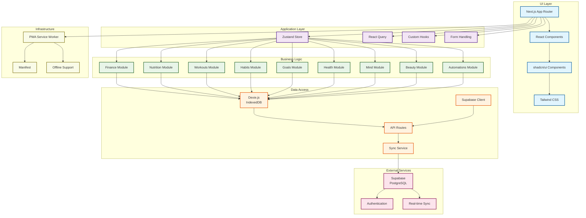

# LifeOS System Architecture

## Architecture Overview

### UI Layer
- **Next.js App Router**: Handles routing and server-side rendering
- **React Components**: Modular component architecture
- **shadcn/ui**: Consistent design system components
- **Tailwind CSS**: Utility-first styling with OKLCH colors

### Application Layer
- **Zustand**: Global state management for UI state
- **React Query**: Server state management and caching
- **Custom Hooks**: Business logic encapsulation
- **Form Handling**: React Hook Form with Zod validation

### Business Logic Layer
Eight specialized modules handling different life domains:
- Finance: Transactions, budgets, investments
- Nutrition: Food tracking, recipes, macros
- Workouts: Programs, exercises, progress
- Habits: Streaks, completions, analytics
- Goals: Long-term objectives, progress tracking
- Health: Metrics, sleep, vital signs
- Mind: Books, courses, learning materials
- Beauty: Routines, products, skincare
- Automations: Rule-based triggers and actions

### Data Access Layer
- **Dexie.js**: Local IndexedDB for offline functionality
- **Supabase Client**: Remote PostgreSQL access
- **API Routes**: Next.js API endpoints
- **Sync Service**: Bidirectional data synchronization

### External Services
- **Supabase**: Backend-as-a-Service providing database, auth, and real-time features
- **Authentication**: User management and security
- **Real-time Sync**: Live data synchronization across devices

### Infrastructure
- **PWA**: Progressive Web App capabilities
- **Service Worker**: Offline support and caching
- **Manifest**: App installation and metadata